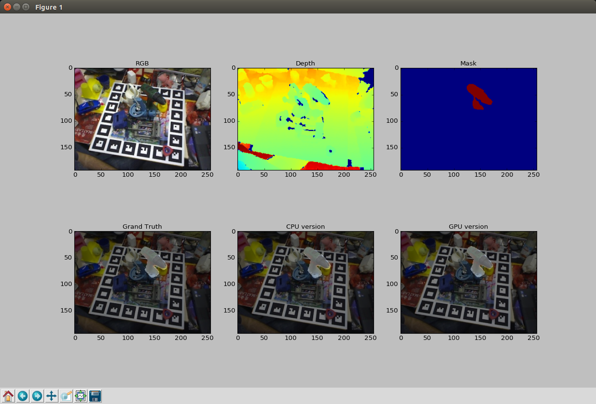

# pose_estimation_gpu


## What is this?
TBE.


regacy version(https://github.com/oshiroy/test/tree/master/pose_estimation_gpu)

## Input Data
RGB image  
Depth image  
Mask image  
Object coordinates candidates  
Object model (.ply)  

## OutPut Data
Position  
Rotation matrix


## Requirements
Eigen, cython, cuda, opengl, glfw3, glew, etc...


## installation glfw3
```python
sudo add-apt-repository ppa:keithw/glfw3
sudo apt-get update
sudo apt-get install libglfw3-dev
```


## Sample
```
pip install -e .
python sample_pose_estimaiton.py
```


